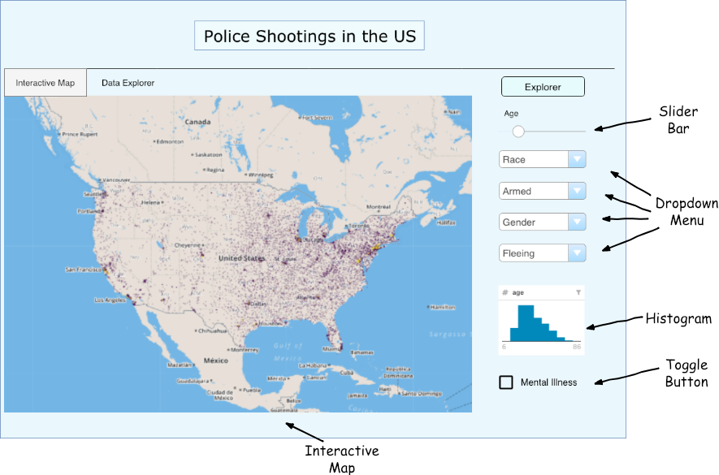
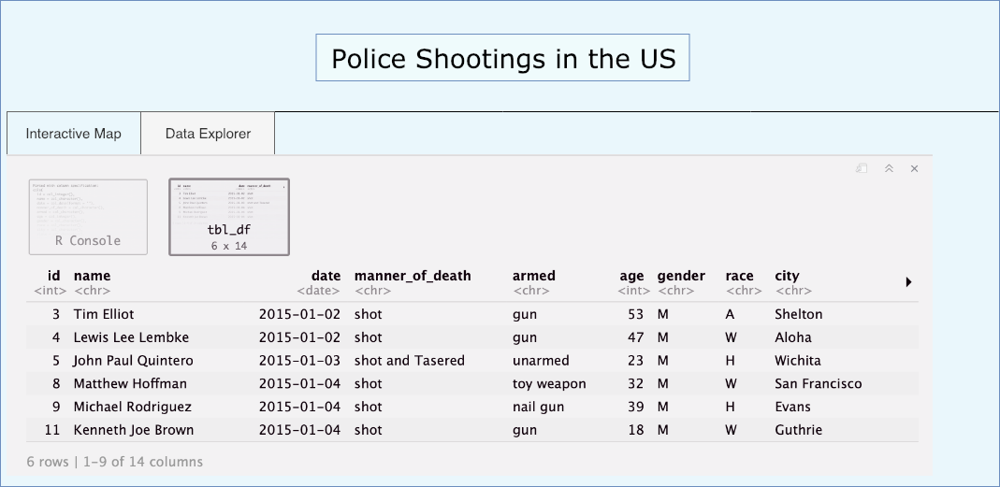

# US Police Shootings Analysis
A Shiny app for the analysis of unjust police shootings in the United States.

## Contributors

- [Aditya Sharma](https://github.com/adityashrm21)
- [Yuwei Liu](https://github.com/liuyuwei169)

## Overview

Since the killing of Michael Brown in Ferguson, Missouri happened in 2014 and its consequential protest movement culminating in Black Lives Matter, there has been an increased focus on tracking police shootings. If we could understand the behavior and circumstances which lead to these civilian deaths, it may be possible to reduce the frequency of unjust police shooting. In order to address this challenge, we propose to build a data visualization app using Shiny that allows researchers and concerned people to visually explore a dataset of police shootings leading to civilian deaths since 2015. The application will show how the factors involved in these shootings are distributed geographically over the United States, as well as how the individual factors are distributed by allowing users to explore different aspects of this data by filtering and re-ordering on different variables in order to compare factors that contribute to civilian deaths. This would provide with useful insights to the user which could then be used to further explore the causes and create strategies and rules to prevent unjust police shooting cases in the future.

## Description of the data

We will be visualizing a [dataset containing 2143 examples of fatal shootings in the United States by a police officer](https://www.kaggle.com/washingtonpost/police-shootings) in the line of duty since January 1, 2015, which involved deaths of civilians. Each shooting has 13 variables associated with it containing information about the civilian killed (name, age, gender, race), the date and location of the shooting (date, city, state), the circumstances under which the civilian was killed (manner_of_death, armed, flee, body_camera) and whether the civilian showed signs of mental illness(signs_of_mental_illness) and the threat level as perceived by the police (threat_level). We will visualize the distributions of variables including the `race, gender, armed, flee, manner_of_death, signs_of_mental_illness, threat_level` along with how these variables vary geographically to try to see if there is any trend by location in the police shootings leading to civilian deaths.

## Usage scenario and tasks

John is a Researcher in the FBI on unjust police shootings, and he is interested in analyzing what factors and circumstances lead to occurrences of shootings on civilians in the US and how these factors and circumstances change by location. He wants to be able to explore a dataset of police shootings on civilians so that he can compare the different variables in the dataset and hopefully find out what factors lead to unjust shootings. When John logs on to the "Police Shootings in US" application, he will be able to see an overview of the relevant variables in the dataset on the map and he will be able to change and filter out different factors on the map. He can compare different states and cities with the selected settings. He will also be able to see the distribution of the variables and study their relationship with the shootings. After some exploration, John might find out that "race" appears to be a strong predictor of the occurrence of unjust police shootings on civilians, whereas other variables may not be so relevant. He hypothesizes that civilians from "black" race are more likely to be shot by the police, which is in accordance with the reasons for the "Black Lives Matter" movement and decides that he needs to do a follow-up study by using more resources and asking for confidential data relevant to the shootings from the FBI.

## App description and sketch

The app would show an interactive map which will display the distribution and trends in various variables from the dataset. There would be a slider bar to select an age range to be used for filtering the data. Below that, there will be a few dropdown menus for particular variables so that their distribution over the map could be seen and changed according to the selected settings. There will be an area for histograms and distributions of variables in the data along with a toggle bar for a binary variable (mental illness). All of the above features could be used to filter the data according to the needs to analyze the trends and reasons for unjust police shootings in the United States. There will also be another tab for the app which will simply display the tabular data and would be a great place for people to explore the dataset. The app would somewhat look the image shown below.

 

The explorer tab would provide a look at the data in tabular format as shown below.

 

