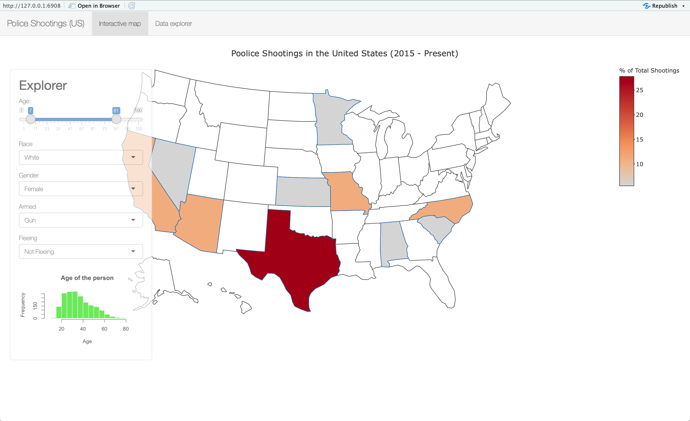

# Shiny App: Police Shootings Analysis in the US

[Link to the shinyapps.io app page](https://adityashrm21.shinyapps.io/us-police-shootings-analysis/)

## Overview

  The purpose of [our shiny app](https://adityashrm21.shinyapps.io/us-police-shootings-analysis/) is to help people analyze the data on Police Shootings in the United States. Given the dataset, we have made an application for researchers to analyze and visualize the data conveniently, efficiently and easily. As shown below, this app has two major parts: the Interactive Map and the Data Explorer. The purpose of the interactive map is to help users visually analyze the trends in police shootings in the US. They can configure different settings of important variables involved and look at the distribution of the data state-wise on the map. Further, they can filter out the data with these variables in the data explorer tab to look at particular data points and any specific variables from the whole dataset. This tab would also allow the users to search for any terms for filtering the data though a search box.

## Screenshots

- Initial page

This tab of the app displays the distribution of shootings with user selected settings on the map. In the explorer panel, the user can adjust the `age`, `race`, `gender` of the shot civilians, as well as how the shot civilians were `armed` and how they were `fleeing`. Some more screenshots showing different configurations are shown below.

- Filter with age

- Filter with female civilians

- Moving the explorer panel to the left

- Drop down menu usage

- Data Explorer tab

This part of the app is to show the original data in tabular format. When the users want more information from the dataset, they can go to this tab and explore the dataset. Users can explore all the columns as well as filter the dataset with specific keywords.

- Search box usage with filters in data explorer

## Rationale

[This Shiny application](https://adityashrm21.shinyapps.io/us-police-shootings-analysis/) was designed in order to enable users and researchers to explore the causes and narrow down on areas in the United States where they see the need to enforce policies and new regulations for police shootings involving civilians. We also allow the users to select the variables(age, gender, fleeing, armed, age) and their configurations interactively. This selection by the users gets reflected on the chloropleth map of the United States. The proportion of civilian deaths by state based on the selected variable settings is calculated in the `Server` of the app and then shown using a color palette on the country map through the `UI`. By using these features, we would like to make users implement these interactions and changes easily and draw effective conclusions. We also display a histogram for the variable `age`, since it is the only numeric variables amongst all. This would help the user gauge which age group is more involved in police shootings in a different states. The data explorer tab would help the users further narrow down on specific examples and create reports in their study and research.

## Tasks

Tasks that arise from the above rationale:

- Creating a map object for United States with demarcated states.
- Adding an explorer panel for the user to select the variable settings.
- Adding dropdown menus (`gender`, `fleeing`, `armed` and `race`) and a slider bar (`age`) for user selection.
- Adding a small histogram display for the `age` variable in the panel.
- Linking the configuration selected in the panel to the display on the chloropleth map
- Adding another tab for data exploration with relevant variables to filter data and a search box for further drilling down on the data.
- Further end-user research (e.g., informal user interviews with classmates or peer review) will help us to know which variables are most informative for the users.
- Thinking about how to improve the application.

## Visual Encoding

We chose to use the `viridis` color palette for the chloropleth map because it is more effective for humans to detect difference in colors with this palette. It uses a better combination of Hue, Luminance and Saturation and hence, is more effective. This would also help colorblind people to easily read the difference in colors on the map. The colors are linked to the proportion of shootings in particular states as compared to the whole country which is gauged using the legend colourbar. There is a `hover` effect on the map which lets the user know the name of the state and the percentage of the shootings with the selected configuration in that state. We think this is a useful feature and it let's user clearly differentiate between the states if the colorbar fails to help in close cases. We also combined all the categories in the relevant categorical variables with very less counts into a single category called `Other`.

## Vision Change

Our vision for the app has certainly changed from what we thought in the initial proposal. In the beginning, we thought of implementing an interactive map with shootings data based on cities in the United States. Some of the features that we thought would be easy to implement when designing the proposal led us to paths where found some roadblocks and therefore, had to change our course of action. This led to some changes in the design of the map and the level of detailed information that could be obtained through the app usage. For example, trying to implement the app using city-level information required us to obtain the latitudes and the longitudes for these cities in order for us to plot them on the map. Google maps API unfortunately failed us with their paid API usage and we resorted to obtaining the latitudes and longitudes data from other sources such as the [United States Cities Dataset](https://simplemaps.com/data/us-cities). This dataset didn't contain all the cities from our dataset which limited our usable data for the app. Further, we tried displaying city level detail on the maps using colors and circle marker size choices. This led to some other limitations such as one city with a higher percentage of shootings overlapping a nearby city on the map completely, thereby rendering it unseen on the map. All these implementation and design choices led to changes in our decisions which ultimately brought us to the version that we have for the app right now!

## Future Improvements

Our goal for the next milestone would be to update the app based on the feedback. We are also planning to have more side plots for the relevant variables. A small portion at the bottom part of the app page could be used to display a small table with a summary of the selected variable configuration. The data could also be displayed city-wise instead of state-wise for an in-depth and more complicated analysis. Radio buttons could be added for other variables such as `mental_illness` which would further help users filter relevant cases based on that variable. Currently, we only chose a few variables that we think were important in the analysis.

## Limitations

Just like any app in the world, this app also has some limitations.

- The first limitation is that we were unable to extract data from google API for maps as it is paid and therefore, we chose `plotly` and it only supports distributing the data by state. This means that, although we have a column for city names in the dataset, we are not using it right now. Therefore, the shootings in different cities but from the same state will be visualized as a whole on the map. This map's precision is only up to the state level.
- Second, we only chose a few variables among all the variables provided for interactivity on the map. This is because we have too many variables and not all of them are important. We are still not sure which variables might be more important for the users at the moment, but we will certainly update them after getting feedback from different sources.
