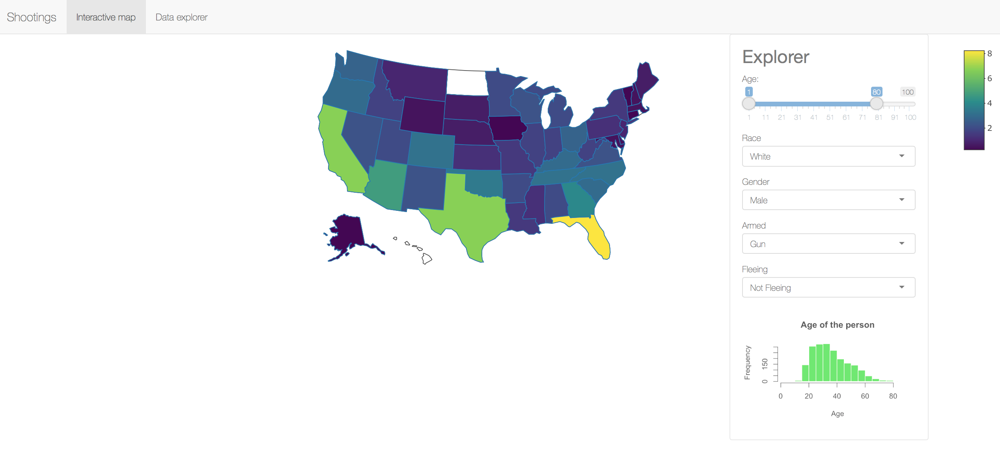
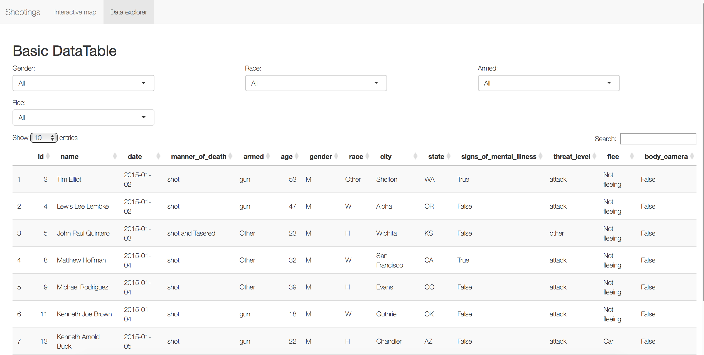

# Shiny App for Police Shooting

## Overview
  The purpose of our shiny app is to help people to analyze the data on Police Shootings. Given the dataset, we have made an app for the researchers to analyze and visulize the data more conviently and easily. As shown below, this app has two major parts: The Interatcive map and the data explorer. The purpose of the interactive map is to help the users visually seeing the different kinds of police shootings in different regions. Users can change the bar and the drop-down menu to interact with the data on the map.
  
## Screenshots of Our App

This part of the app is to show the distribution of different kinds of shootings on the US map. At the right, the user can adjust the `Age`, `Race`, `Gender` of the shot civilians, as well as how the shot civilians were `armed` and how the shot cilivilians were `fleeing`. 

This part of the app is to show the original data. When the users want more infomation of the dataset, they can go to this part and explore the data. There are also some unimportant columns not covered, or just unable to cover in the interactive maps, so users can explore those columns here as well. 

## Rationale

The rationale of designing this app is that we would like to use this app to show the users how the shootings distribute geographically, so that the user has a big picture of the shootings. We also allow the users to use the variables interactively. Therefore, at the right, the users can limit any variable in certain range interactively. All the result of proportions will be showed on the map with colors. By using these, we would like to make users implement these interactions and changes easily. We also have a histogram for the variable `age`, since it is the only numeric variables among all. We also designed the data explorer part, so if the users want further infomation, they can go to there and check themselves.

## Tasks

These were the tasks for Milestone 2:

* Use plotly from R to extract the map.
* Build a map of US, and add data points on the states they are in on the map.
* Create sidepanel for variables to filter data, and update the map accordingly.
* create plot that shows the distribution of age.
* Build the tab for data exploration.
* Further user research (e.g., informal user interviews with classmates or peer review) will help us to know which variables are most informative for the users.
* Think about how to improve the app.

Our goal for the next milestone is to update the variables we chose to interact in the map based on the feedback. We are also planning to have more side plots for the preferred variables, based on the feedback. At the moment, the problem is that since they are so many variables in the data, we are not sure which variables are most useful for the users, so we only chose a few variables that we think are important. At the end, we are expecting our milstone to update more side plots for different variables.

## Limitation
  Just like any app in the world, this app also has some limitations. The first limitation is that since we are unable to export the google API, we are using plotly and it only supports distributing the data by state. This means that, although we have a column for city names in the dataset, we are not using it. Therefore, the shootings of different cities but of the same state will be visulized as a whole in the map. This map's precision is only upon the state level. 
  
  Second, we only chose a few variables among all the variables provided for interaction on the map. This is because we have too many variables and some of them are not important. We are still not sure which variables are important for the users at the moment, but we will certainly update them after the feedbacks.
  
  Third, although we have shown the proportion of certain kinds of shot civilians for each state in the map, it is important to remember that since the proportion of certain kinds of civilians are different in each state originally, the comparasion of the proportions among states might be useless. For example, there is a state having more black male of age 20-40 than another state originally, then that state probably will have high proportion of shot cilivilians of this kind.
