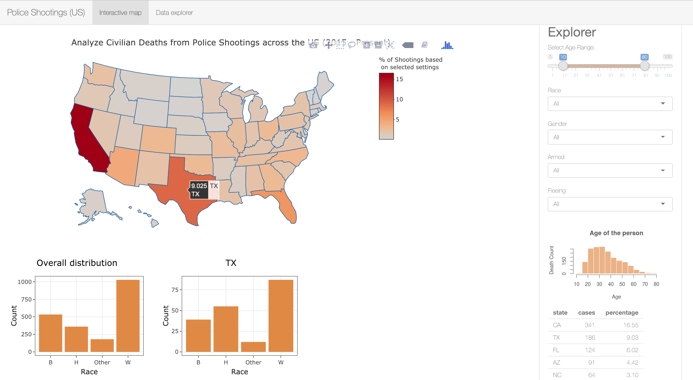
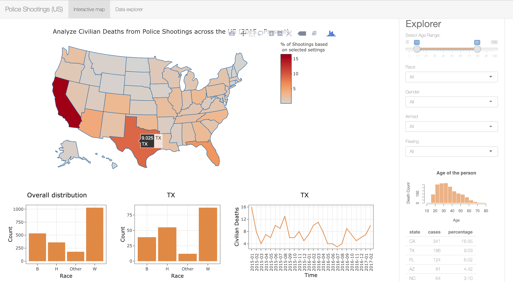

# Last Improvement

At the present stage, we are quite happy with the app and its ability to accomplish the goal we started with. It came out really well and received positive feedback from peers as well as the instructors but as we know, nothing is perfect and there is always room for improvement! Users would be more interested in using the app if they feel connected to the task and the cause and this is exactly what led us to the final improvement in our app.

In this writeup, we discuss the changes and last-minute decisions that we took in order to carry out the final improvements and finishing touches to our app.

## Changes

We decided to implement some new features which revolve around the original theme and inspiration for our app, the "Black Lives Matter" movement and the use case scenarios which arise for analysts to carefully study unjust police shootings and their relationship to the race of the civilians involved. This resonates with our original idea and helps a user of the app dig in deeper state-wise to analyze any `race` related trends.

- **Adding a time-series line chart for each state on click:** We implemented the click feature on our map where users can click on any state on the map and a time-series line chart will be produced giving the number of civilian death cases over time for that particular state.
- **Adding a bar chart for racial distribution of each state on hover:** This feature allows the users of the app to hover over any state and instantly obtain the racial distribution of that particular state in the US. This is useful as it helps to look at distribution over a state which the original app with just the dropdown menu options for `race` did not allow.
- **Adding a bar chart for overall racial distribution of the US:** This feature was implemented with the purpose of allowing the users to have a look at the overall national racial distribution for the civilians who died in police shootings. Having this plot beside the hover over bar plot feature for each state also allows for a clear comparison of the racial distribution of the state with that of the country.

#### The Hover feature

#### The Click feature

Implementing these features has provided the app and the users with more flexibility to study individual states rather than the national demography originally shown on the choropleth map of the United States. With the little time we had for this milestone, we surveyed a few peers and took their feedback on the new features. With confidence, we can say that these features have been successful in improving the app and its overall purpose.

## What would we do differently the next time?

If we were to design and build such an app from scratch again, we would first try to put in more brainstorming effort than starting to build the app quickly. We believe that time well-spent thinking before starting to code and discussing possible ideas and solutions would provide better insight and a shorter path to a successful application. Also, researching well before trying to implement a feature would save a lot of time and futile effort spent on coding the idea. A final thing that we would like to say here would be that we need to be aware of the fact that ideas do change and evolve over time and sometimes the final product that comes out may not be much close to what we think initially and that is completely okay!

## Greatest Challenges

Some of the greatest challenges we faced were a blend of coding challenges as well as design thinking issues. Implementing some features like the hover and the click interactivity required us to figure out how `Plotly` is encoding the states from the choropleth map and how it is linking them to the `event_data` object output on the server side. It took a bit of thinking and solving this puzzle before we ultimately found out that it adjusts the names alphabetically and we will have to create a map of the state names with an index in this order from our dataset to manipulate the incoming hover/click object output to use. Another major challenge that we faced was to remove any pre-imposed conditional filters on the map by default. Implementing this feature took a lot of time and effort from our side as adding conditional filters using `dplyr's` `filter` is not straightforward and simply using an `if_else()` clause inside the filter does not help. We were able to implement this feature using filters outside `filter()` and then using them in `filter()` by checking the presence of the corresponding variable in the selected/required categories.

Overall, the project and the challenges helped us learn a lot and like any other learning process, have helped us imbibe confidence in building shiny applications in R.
